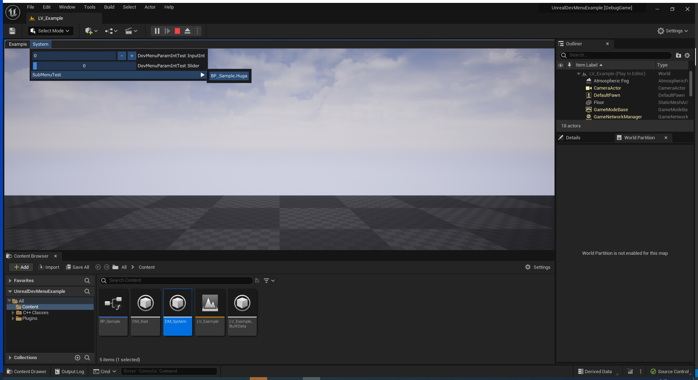
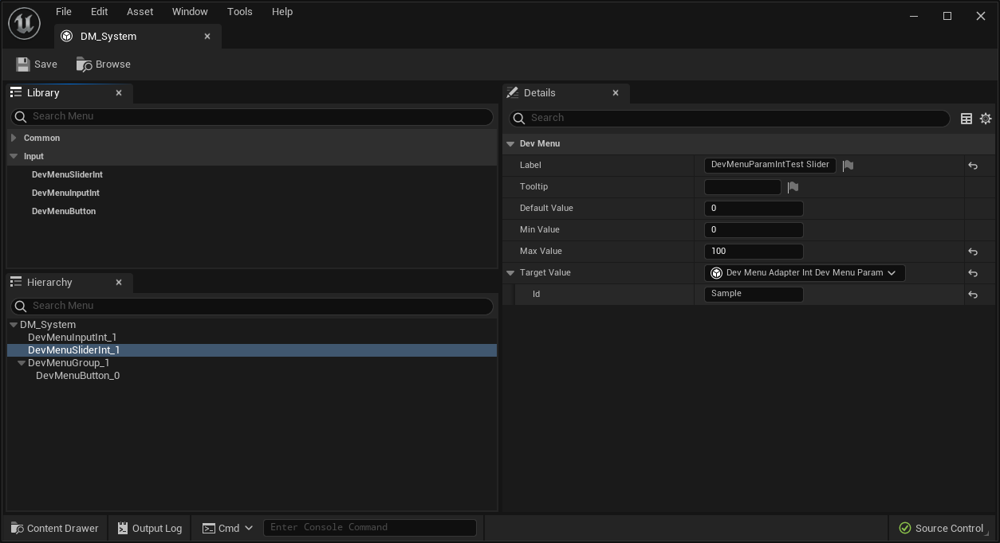

# UnrealDevMenuExample

[UnrealDevMenu](https://github.com/laycnc/UnrealDevMenu/tree/9895c8f5e00d1de61f90dd7d2170329a7cfd63ae)のサンプルプロジェクトです。  

[UnrealDevMenu](https://github.com/laycnc/UnrealDevMenu/tree/9895c8f5e00d1de61f90dd7d2170329a7cfd63ae)は、[Dear ImGui](https://github.com/ocornut/imgui)とUnrealEngineで活用する為のプラグイン[UnrealImGui](https://github.com/WiggleWizard/UnrealImGui/tree/48b1abd1e190f5b02b87f9452056c27c7f622d1d)を使ったデバッグメニューを簡単に実装する為のプラグインです。


実行している様子

  

アセット編集画面




# ビルド方法

参照しているサブモジュールの更新が必要になります。  

```cmd
git submodule update --init
```